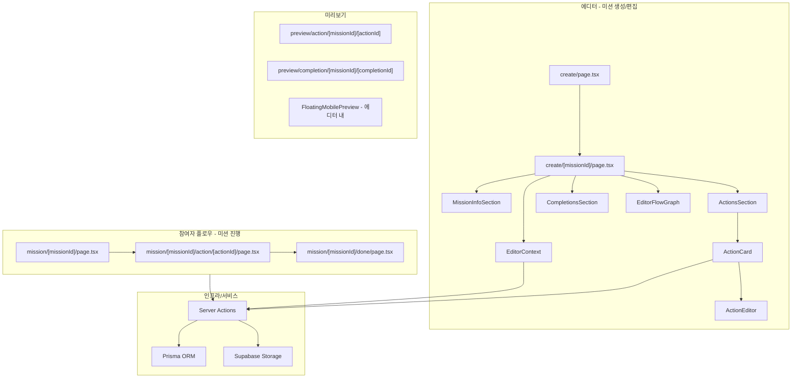

# 미션 플로우 기술 스택 및 코드 정리

미션(설문/테스트) 생성·편집(에디터), 참여자 진행 플로우, 미리보기의 3영역 구조와 Pollia 적용 현황을 정리합니다.

---

## 전체 아키텍처

미션 플로우는 **에디터(생성/편집)**, **참여자 플로우(미션 진행)**, **미리보기** 3영역으로 나뉘며, **Server Actions** 기반으로 동작합니다. (별도 API 라우트 없음)



---

## 라우트 매핑 (참조 명세 → Pollia)

| 참조 명세 | Pollia 경로 | 비고 |
|-----------|-------------|------|
| create/new | `/create` | 목록 + "미션 추가" 시 새 Mission 생성 후 편집으로 이동 |
| create/projectId | `/create/[missionId]` | 풀페이지 에디터 |
| p/projectId (참여 인트로) | `/mission/[missionId]` | 미션 소개·시작 |
| p/projectId/m/missionId | `/mission/[missionId]/action/[actionId]` | 질문(액션) 진행 |
| p/projectId/done | `/mission/[missionId]/done` | 완료 화면 |
| preview/mission/... | `/preview/action/...`, `/preview/completion/...` | 액션/완료 미리보기 |

---

## 영역별 사용 라이브러리 및 코드

### 1. 프레임워크 / 핵심

| 항목 | Pollia | 참조 명세 | 비고 |
|------|--------|-----------|------|
| Next.js | 15.5.7 | 16.x | App Router, Server Components, Server Actions |
| React | 19.1.2 | 19.x | UI, useState/useEffect/useCallback/useRef |
| TypeScript | ^5 | ^5 | 타입 시스템 |
| Tailwind | @repo/tailwind-config (v4) | ^4 | 스타일링 |
| 폼/상태 | useState + 디바운스 + Server Action 직접 호출 | useMissionForm 등 커스텀 hook | 에디터는 전역 EditorContext + 로컬 state |
| 유효성 검증 | **Zod** (schemas/) | 서버 액션 내 직접 검증 | Pollia는 07-server-layers에 따라 Zod 스키마 공유 |

### 2. 마크다운 에디터 / 렌더링

| 라이브러리 | Pollia 버전 | 용도 | 사용처 |
|------------|-------------|------|--------|
| @tiptap/react | ^3.19.0 | 리치 텍스트 에디터 | MarkdownEditor |
| @tiptap/starter-kit | ^3.19.0 | 기본 확장 | MarkdownEditor |
| @tiptap/extension-placeholder | ^3.19.0 | placeholder | MarkdownEditor |
| @tiptap/extension-text-align | ^3.19.0 | 정렬 | admin TiptapField |
| tiptap-markdown | 미사용 | MD 변환 | - (에디터는 HTML 저장) |
| @tiptap/extension-character-count | 미사용 | 글자수 | MarkdownEditor는 수동 계산 |
| react-markdown | 미사용 | MD 렌더링 | - (필요 시 추가) |

### 3. 플로우 다이어그램

| 라이브러리 | Pollia | 참조 명세 | 용도 | 사용처 |
|------------|--------|-----------|------|--------|
| @xyflow/react | ^12.10.0 | ^12.10.1 | 노드/엣지 플로우 | Admin FlowCanvas, 에디터 EditorFlowGraph |
| 레이아웃 | **elkjs** ^0.11.0 | @dagrejs/dagre ^2.0.4 | 자동 레이아웃 | Admin만 elkjs 사용, 에디터는 단순 수직 배치 |

- **Admin**: `apps/web/src/app/admin/missions/[id]/flow/` — FlowCanvas, flowTransform(elkjs), 노드/엣지 편집.
- **에디터**: `apps/web/src/app/(site)/(main)/create/[missionId]/` — EditorFlowGraph, editorFlowGraph.ts(수직 배치), 읽기 전용 + 노드 클릭 시 해당 카드 포커스.

### 4. DB / 백엔드

| 라이브러리 | Pollia | 용도 | 사용처 |
|------------|--------|------|--------|
| Prisma | ^6.19.0 | ORM, 스키마 | Server Actions → Service → Repository |
| PostgreSQL | (Prisma 통해) | DB | Supabase 등 |
| @supabase/ssr, @supabase/supabase-js | ^2.x | 세션·스토리지 | 이미지 업로드(actions/common/files 등) |

### 5. AI

| 라이브러리 | Pollia | 참조 명세 | 비고 |
|------------|--------|-----------|------|
| @anthropic-ai/sdk | 미사용 | ^0.78.0 | fillProjectWithAI 등 미구현 시 도입 검토 |

### 6. UI / 유틸리티

| 라이브러리 | Pollia | 용도 | 사용처 |
|------------|--------|------|--------|
| lucide-react | ^0.555.0 | 아이콘 | 전역 |
| react-hook-form | ^7.66.1 | 폼 (admin 등) | 에디터는 미사용, admin 일부 |
| createPortal | (react-dom) | 포털 | BranchSheet 미구현 시 사용 |
| next/image | 내장 | 이미지 최적화 | MissionClient, 카드 등 |

---

## 주요 Server Actions 정리

에디터·참여자 액션은 **단일 actions.ts가 아니라 도메인별 파일**로 나뉘며, **Action → Service → Repository** 3계층을 따릅니다.

### 에디터 측

| 기능 | Pollia 위치 | 비고 |
|------|-------------|------|
| 미션 추가 | `actions/mission/create.ts` (createMission) | |
| 미션 기본 정보 저장 | `actions/mission/update.ts` (updateMission) | 디바운스/onBlur에서 호출 |
| 미션 공개/비공개 | `actions/mission/update.ts` ({ isActive }) | |
| 미션 삭제 | `actions/mission/delete.ts` | |
| 액션(질문) 추가 | `actions/action/create.ts` (createShortTextAction 등) | 타입별 create* |
| 액션 저장 | `actions/action/update.ts` (updateAction) | |
| 액션 삭제 | `actions/action/delete.ts` | |
| 액션 순서 변경 | `actions/action/reorder.ts` (reorderActions) | |
| 선택지 분기 | `actions/action/update.ts`, action-option | updateOptionBranch 등 (admin 쪽 연결 액션 참고) |
| 완료 화면 CRUD | `actions/mission-completion/create.ts`, update, delete, list | |
| AI 일괄 생성 | 미구현 | fillProjectWithAI 시 Anthropic 등 도입 |

### 참여자 측

| 기능 | Pollia 위치 | 비고 |
|------|-------------|------|
| 답변 제출·분기 | `actions/action-answer/submitAndNavigate.ts`, `actions/mission-response/create.ts` | 제출 후 다음 액션/완료 화면으로 이동 |
| 답변 이미지 업로드 | `actions/common/files` (create 등) + useImageUpload | |

---

## 특징 요약

| 항목 | 참조 명세 | Pollia |
|------|-----------|--------|
| 폼 라이브러리 | 미사용 (useState + useMissionForm) | 에디터: 미사용 (useState + 디바운스). admin 일부는 react-hook-form 사용 |
| Validation | 서버 액션 내 직접 검증 | **Zod** (schemas/) + 서버에서 parse, 07-server-layers 준수 |
| 상태 관리 | Context + useState | **EditorContext** + useState, 전역 미저장/프리뷰 상태 |
| API 라우트 | 없음 (Server Actions) | 동일 (미션 관련은 Server Actions) |
| 액션 타입 | CHOICE, TEXT, SCALE, IMAGE, SHORT_TEXT, TAG, DATE (7가지) | **MULTIPLE_CHOICE, SCALE, RATING, TAG, SUBJECTIVE, SHORT_TEXT, IMAGE, VIDEO, PDF, DATE, TIME, BRANCH** (Prisma ActionType) |
| 플로우 레이아웃 | dagre | Admin: **elkjs**, 에디터: 단순 수직 배치 |

---

## 에디터 디렉터리 구조 (Pollia)

```
apps/web/src/app/(site)/(main)/create/
├── page.tsx                    # 목록 + 미션 추가
├── layout.tsx                  # requireActiveUser
├── components/
│   ├── CreatePageClient.tsx
│   ├── BasicInfoCard.tsx       # (기존 퍼널용, 에디터는 [missionId] 쪽 사용)
│   └── ...
└── [missionId]/
    ├── layout.tsx              # 데이터 로드, EditorProvider
    ├── page.tsx                # MissionInfoSection, ActionsSection, CompletionsSection
    ├── context/
    │   └── EditorContext.tsx
    ├── lib/
    │   ├── toEditorPreview.ts
    │   └── editorFlowGraph.ts
    └── components/
        ├── EditorLayout.tsx
        ├── EditorHeader.tsx
        ├── MissionInfoSection.tsx
        ├── ActionsSection.tsx
        ├── ActionCard.tsx
        ├── ActionEditor.tsx
        ├── CompletionsSection.tsx
        ├── CompletionCard.tsx
        ├── MobilePreview.tsx
        ├── FloatingMobilePreview.tsx
        ├── EditorFlowGraph.tsx
        ├── FloatingFlowPanel.tsx
        ├── FlowModal.tsx
        ├── flow/EditorFlowNodes.tsx
        ├── UnsavedChangesModal.tsx
        └── DeleteConfirmModal.tsx
```

---

## 참고

- 서버 계층: `.cursor/rules/07-server-layers.mdc` (Action → Service → Repository, DTO, Zod).
- Admin 미션 플로우: `apps/web/src/app/admin/missions/[id]/flow/` (편집용 플로우, elkjs, 연결/해제 액션).
